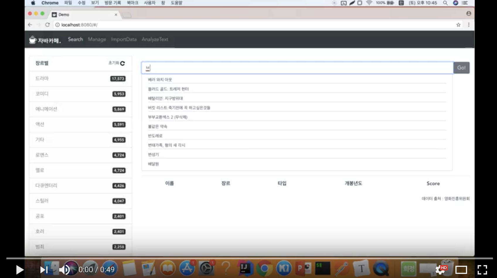
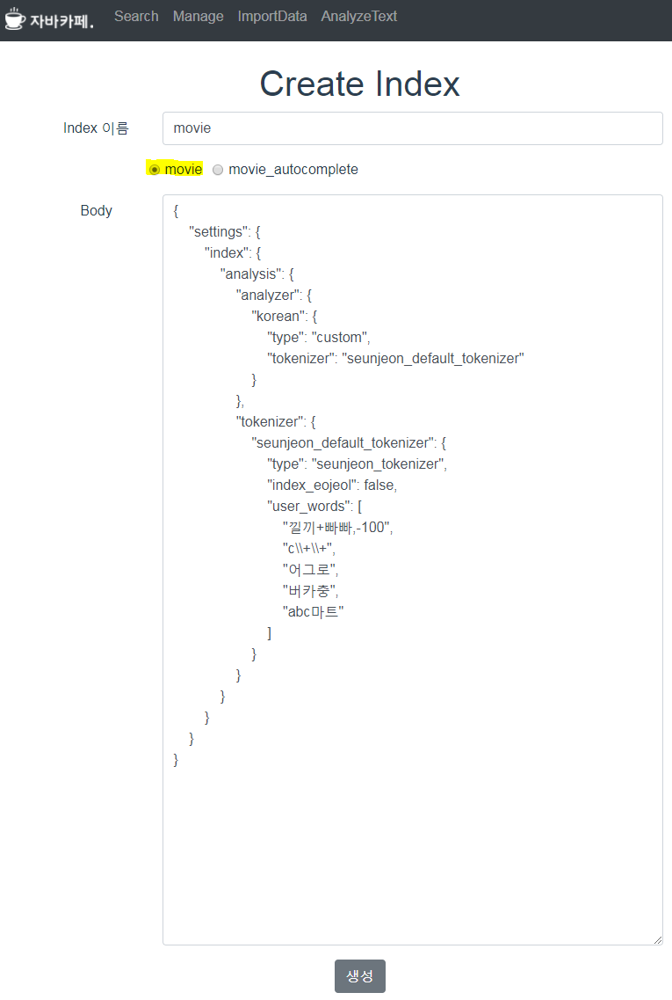
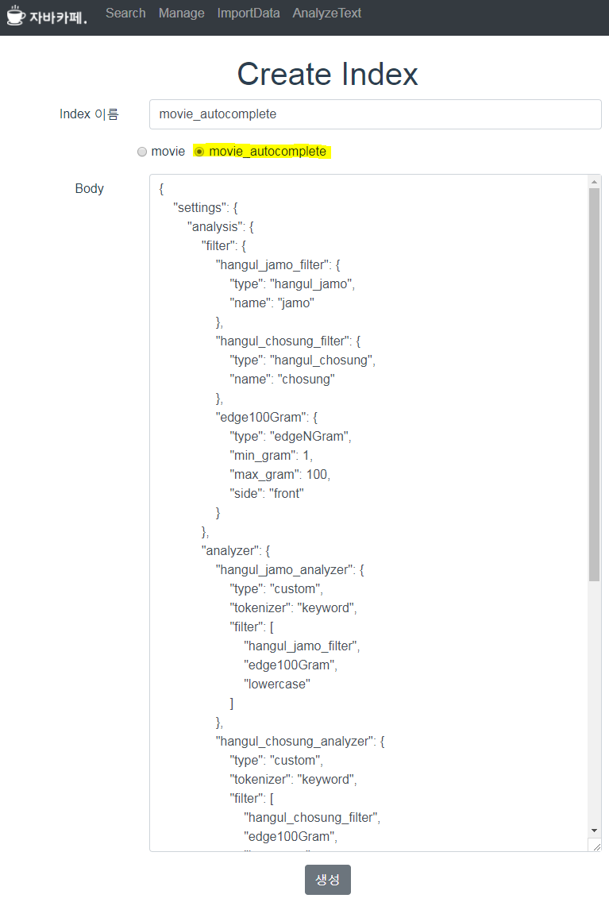
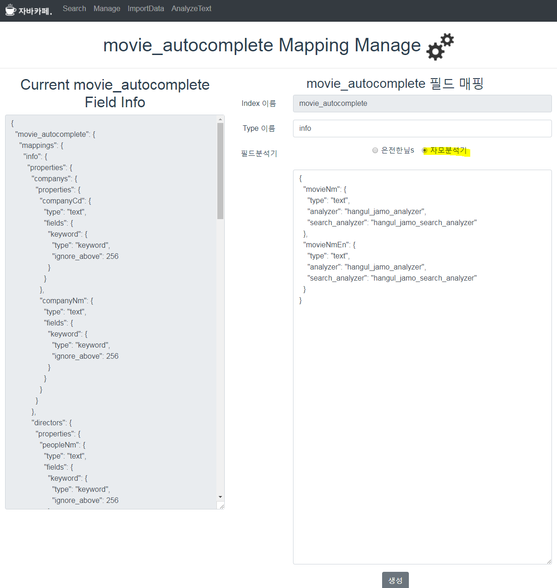
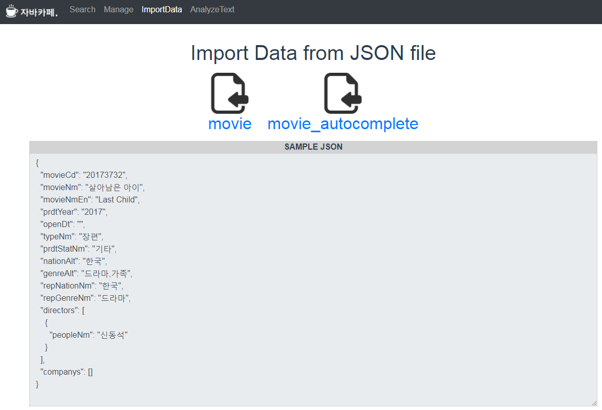
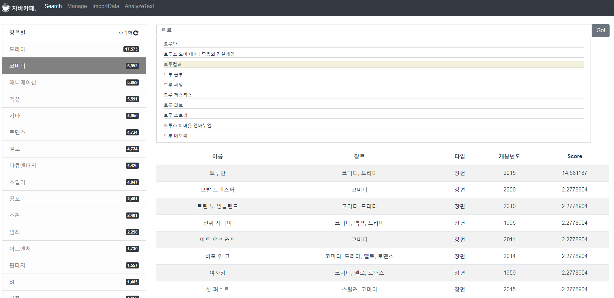
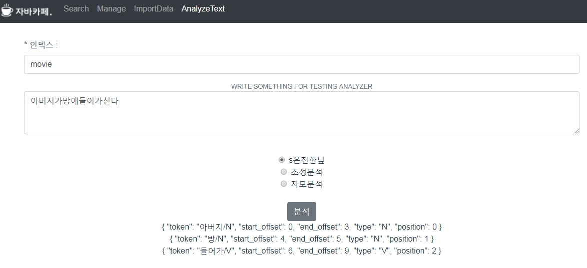

# movie-finder
> 오픈소스 검색엔진인 Elasticsearch 를 활용하여 '영화'를 검색을 하는 Vue.js 프로젝트


# 예제
* youtube link
[](https://youtu.be/JEVCMqyYUL8 "ElasticsearchWithElasticsearch")


## 실행 전 준비사항

### 1. Java 8 설치

### 2. Elasticsearch 6.0.0 이상 버전 설치
  * [엘라스틱서치 공식 홈페이지 다운로드 페이지](https://www.elastic.co/downloads/past-releases)
  * [Elasticsearch 설치 방법](https://www.elastic.co/guide/en/elasticsearch/reference/6.0/_installation.html)

### 3. Elasticsearch 분석기(Analyzer) 플러그인 설치

   (1) s은전한닢 분석기 설치
   * 설치방법 : https://bitbucket.org/eunjeon/seunjeon/src/d2c16421897cd76ef2edab451d674d81b0a14a00/elasticsearch/?at=master
   
   (2) 자모 분석기 설치
   * 링크 : https://github.com/punxism/elasticsearch-hangul-jamo-plugin 에서 소스 다운로드
   * `/src/mainresources/plugin-descriptor.properties` 수정
     ~~~
      elasticsearch.version=6.0.0 (해당 엘라스틱서치 버전에 맞게 수정)
     ~~~
     
   * `pom.xml` 수정 (해당 엘라스틱서치 버전에 맞게 루씬, 엘라스틱서치 버전 수정)
     ~~~ xml
      <properties>
          <elasticsearch.version>6.0.0</elasticsearch.version>
          <lucene.version>7.0.1</lucene.version>
      </properties>
     ~~~
     
     * 빌드
     ~~~ bash
      mvn clean package
     ~~~
     
     * 플러그인 설치 : 빌드된 zip 파일 사용하여 플러그인 설치
     ~~~ bash
      ${elasticsearch.home}/bin/elasticsearch-plugin install file://${project.basedir}/target/releases/elasticsearch-hangul-jamo-analyzer-{version}.zip
     ~~~
  
### 4. node.js 설치
  * 링크 : https://nodejs.org/ko/
  * 버전 8.9.4 이상


## 프로젝트 실행

``` bash
# install dependencies
npm install

# serve with hot reload at localhost:8080
npm run dev

# build for production with minification
npm run build

# build for production and view the bundle analyzer report
npm run build --report
```

For a detailed explanation on how things work, check out the [guide](http://vuejs-templates.github.io/webpack/) and [docs for vue-loader](http://vuejs.github.io/vue-loader).


## 예제 설명
  (1). 인덱스 생성
  * `Manage` 메뉴에서 `Create Index` 클릭 후, `movie` 생성
    
    
  * `Manage` 메뉴에서 `Create Index` 클릭 후, `movie_autocomplete` 생성
    
  
  (2) 필드 매핑 설정
  * `Manage` 메뉴에서 `movie`에서 설정 버튼을 클릭 후, `은전한닢s` 클릭 후 필드 매핑 생성
    
  
  * `Manage` 메뉴에서 `movie_autocomplete`에서 설정 버튼을 클릭 후, `자모분석기` 클릭 후 필드 매핑 생성
    
  
  (3) 데이터 색인
  * `ImportData` 메뉴에서 movie 클릭
  * `ImportData` 메뉴에서 movie_autocomplete 클릭
    
  
  (4) 검색
  * `Search` 탭에서 검색 결과 확인
  
  
  (5) 분석기 확인
  * `AnalyzeText` 메뉴에서 분석기 확인
    


## 폴더 구조 설명
~~~
/config : 설정정보
 ㄴ elasticsearch.env.js : 엘라스틱 서치 호스트 및 포트 정보
 
/src/api : 엘라스틱서치 api 모음
 ㄴ bulk.js : bulk api
 ㄴ cat.js : cat api
 ㄴ elasticsearchConnection.js : 엘라스틱서치 클라이언트(연결)
 ㄴ indice : index api
 ㄴ search : search api
 
/assets : 정적 파일 폴더

/components : vue.js 컴포넌트

/rawdata : 원본데이터 (출처 : 영화진흥위원회)

/router : 라우팅 관련 폴더
~~~ 

## 참고
* 엘라스틱서치와 movie-finder 프로젝트가 동일한 도메인이 아닐경우, CORS 설정 필요
~~~
No 'Access-Control-Allow-Origin' header is present on the requested resource. Origin ~~~
~~~

* elasticserach_home/config/elasticsearch.yml 파일에서 아래 추가
~~~
http.cors.enabled: true
http.cors.allow-origin: "*"
http.cors.allow-methods: OPTIONS, HEAD, GET, POST, PUT, DELETE
http.cors.allow-headers: "X-Requested-With,X-Auth-Token,Content-Type, Content-Length, Authorization"
~~~


## 지원 브라우저(Support Browser)
* Chrome

## 데이터 출처
* 영화관입장권통합전산망 오픈 API (영화진흥위원회)

## Additional Link
* 자바카페 블로그 : http://tech.javacafe.io/
* 자바카페 git : https://github.com/JAVACAFE-STUDY
